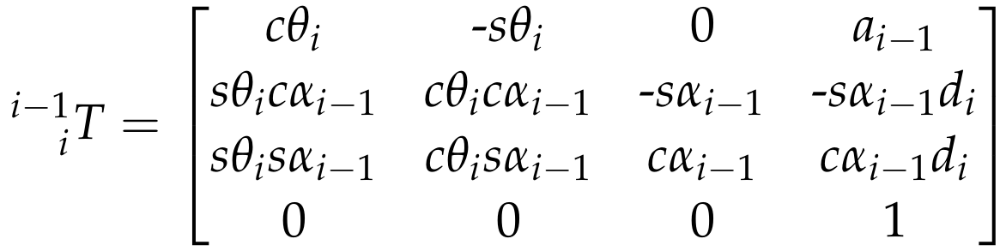

## Project: Kinematics Pick & Place
### Writeup Template: You can use this file as a template for your writeup if you want to submit it as a markdown file, but feel free to use some other method and submit a pdf if you prefer.

---


**Steps to complete the project:**  


1. Set up your ROS Workspace.
2. Download or clone the [project repository](https://github.com/udacity/RoboND-Kinematics-Project) into the ***src*** directory of your ROS Workspace.  
3. Experiment with the forward_kinematics environment and get familiar with the robot.
4. Launch in [demo mode](https://classroom.udacity.com/nanodegrees/nd209/parts/7b2fd2d7-e181-401e-977a-6158c77bf816/modules/8855de3f-2897-46c3-a805-628b5ecf045b/lessons/91d017b1-4493-4522-ad52-04a74a01094c/concepts/ae64bb91-e8c4-44c9-adbe-798e8f688193).
5. Perform Kinematic Analysis for the robot following the [project rubric](https://review.udacity.com/#!/rubrics/972/view).
6. Fill in the `IK_server.py` with your Inverse Kinematics code.


[//]: # (Image References)

## [Rubric](https://review.udacity.com/#!/rubrics/972/view) Points
### Here I will consider the rubric points individually and describe how I addressed each point in my implementation.  

---
### Writeup / README

#### 1. Provide a Writeup / README that includes all the rubric points and how you addressed each one.  You can submit your writeup as markdown or pdf.  

You're reading it!

### Kinematic Analysis
#### 1. Run the forward_kinematics demo and evaluate the kr210.urdf.xacro file to perform kinematic analysis of Kuka KR210 robot and derive its DH parameters.

Here is the Link frames and joint structure of Kuka KR210,


Links | alpha(i-1) | a(i-1) | d(i-1) | theta(i)
--- | --- | --- | --- | ---
0->1 | 0 | 0 | 0.75 | q1
1->2 | -pi/2 | 0.35 | 0 | -pi/2 + q2
2->3 | 0 | 1.25 | 0 | q3
3->4 | -pi/2 | -0.054 | 1.5 | q4
4->5 | pi/2 | 0 | 0 | q5
5->6 | -pi/2 | 0 | 0 | q6
6->EE | 0 | 0 | 0.303 | 0
where;


#### 2. Using the DH parameter table you derived earlier, create individual transformation matrices about each joint. In addition, also generate a generalized homogeneous transform between base_link and gripper_link using only end-effector(gripper) pose.
First of all, the definition of the homogeneous transform from frame i-1_th to frame i_th is below;


where;
 * Rx/Rz:Rotation around X/Z axis
 * Dx/Dz:Transformation along X/Z axis
 * c:cosine
 * s:sine

The individual transformatnion matrices are below; where the J0,J3,J5 are the roll joint, and J1,J2,J4 are the pitch joint. The basic structure is the same in each roll and pitch joint.
```python
T0_1 = [[cos(q1), -sin(q1), 0, 0],
        [sin(q1), cos(q1),0,0],
        [0,0,1,0.75],
        [0,0,0,1]]

T1_2 = [[sin(q2), cos(q2), 0, 0.35],
        [0,0,1,0],
        [cos(q2),-sin(q2),0,0],
        [0,0,0,1]]

T2_3 = [[cos(q3), -sin(q3), 0, 1.25],
        [sin(q3), cos(q3),0,0],
        [0,0,1,0],
        [0,0,0,1]]

T3_4 = [[cos(q4), -sin(q4), 0, -0.054],
        [0,0,1,1.5],
        [-sin(q4),-cos(q4),0,0],
        [0,0,0,1]]

T4_5 = [[cos(q5), -sin(q5), 0, 0],
        [0,0,-1,0],
        [sin(q5),cos(q5),0,0],
        [0,0,0,1]]

T5_6 = [[cos(q6), -sin(q6), 0, 0],
        [0,0,1,0],
        [-sin(q6),-cos(q6),0,0],
        [0,0,0,1]]

T5_6 = [[1,0,0,0],
        [0,1,0,0],
        [0,0,1,0.303],
        [0,0,0,1]]

```

The Generalized homogeneous transform of baselink and gripperlink is below;
```python
Matrix([
	[cos(p)*cos(y), sin(p)*sin(r)*cos(y) - sin(y)*cos(r), sin(p)*cos(r)*cos(y) + sin(r)*sin(y), x],
	[sin(y)*cos(p), sin(p)*sin(r)*sin(y) + cos(r)*cos(y), sin(p)*sin(y)*cos(r) - sin(r)*cos(y), y],
	[-sin(p), sin(r)*cos(p), cos(p)*cos(r), z],
	[0, 0, 0, 1]])
```


#### 3. Decouple Inverse Kinematics problem into Inverse Position Kinematics and inverse Orientation Kinematics; doing so derive the equations to calculate all individual joint angles.

The structure of Joint4,5,6 is the Spherical Wrist, so the Wrist Center(WC) and the orientation of the End Effector(EE) can be sepalatable independantly. To do this, I did solve the position of WC then I solve the composition of rotation of the orient of EE.

The calculation of WC position is below;
pos0_WC = pos0_EE - d7 * rot0_E[:,2]
where;
 * pos0_WC : Location of the WC in the base frame
 * pos0_EE : Location of the EE in the base frame
 * d7 : Link length from WC to EE
 * rot0_E : Rotation of the EE in the base frame

In below we will calculate the theta1,2,3. In the basis to do that, we already know the position of all the joints in the base frame, so we will re-calculate the angles of joint using the position(=Inverse Kinematics).

First, we calculate the theta 1 of Joint1 which is based on the x and y position of WC;
```
theta1 = atan2(pos0_WC[1], pos0_WC[0])
```
then next, we calculate the theta2, 3;
```
theta2 = pi/2 - alpha - delta
theta3 = pi/2 - beta - epsilon

alpha = acos((b**2 + c**2 - a**2) / (2 * b * c))
alpha = acos((a**2 + c**2 - b**2) / (2 * a * c))

delta = atan2(pos0_WC - d1, sqrt(pos0_WC[0]**2 + pos0_WC[1]**2) - a1)
epsilon = atan2(-a3, a4)
```
where these are basis on the Law of cosines. Finally we can calculate the theata4,5,6. Before that we need to calculate R3_6 like below;
```
R3_6
= inverse(R0_3) * R0_6
= (T3_4 * T4_5 * T5_6)[:3, :3]

theta4 = atan2(rot3_6[2,2], -rot3_6[])
theta5 = atan2(sqrt(rot3_6[0, 2]**2 + rot3_6[2, 2]**2), rot3_6[1, 2])
theta6 = atan2(-rot3_6[1, 1], rot3_6[1, 0])
```

### Project Implementation

#### 1. Fill in the `IK_server.py` file with properly commented python code for calculating Inverse Kinematics based on previously performed Kinematic Analysis. Your code must guide the robot to successfully complete 8/10 pick and place cycles. Briefly discuss the code you implemented and your results.

In the initialize_global_variables() function, I did the initialization of valuables to make the code readable. Of course I did the Inverse Kinematics to empower the arm, and also implement the Forward kinematics to calculate the EE position Error.
